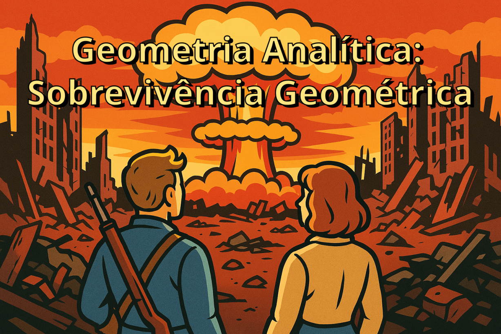

Bem-vindo ao repositório do curso "Geometria Analítica: Sobrevivência Geométrica"! Inspirado na estética pós-apocalíptica de Fallout, este curso oferece uma abordagem única e envolvente para o estudo da Geometria Analítica.

Referência do Livro Adotado

MACHADO, Antônio dos Santos. *Álgebra linear e geometria analítica*. 2. ed.  
São Paulo: Atual, 1982.

# [Provas](PROVAS.md)

# Índice de Conteúdo

## [Capítulo 0 - Preparação para a Wasteland](https://oangelo.github.io/Geometria-Analitica-Sobrevivencia-Geometrica/slide-decks/capitulo-0.html)

1. [Propriedades algébricas fundamentais](https://oangelo.github.io/Geometria-Analitica-Sobrevivencia-Geometrica/exercicios/capitulo-0/algebra.html)

2. [Operações com frações e proporções](https://oangelo.github.io/Geometria-Analitica-Sobrevivencia-Geometrica/exercicios/capitulo-0/fracoes.html)

3. [Equações lineares e sistemas](https://oangelo.github.io/Geometria-Analitica-Sobrevivencia-Geometrica/exercicios/capitulo-0/sistemas-equacoes-lineares.html)

4. [Ângulos, triângulos e trigonometria fundamental](https://oangelo.github.io/Geometria-Analitica-Sobrevivencia-Geometrica/exercicios/capitulo-0/trigonometria.html)

5. [Revisão](https://oangelo.github.io/Geometria-Analitica-Sobrevivencia-Geometrica/exercicios/capitulo-0/revisao.html)

## [Capítulo I - O Espaço Vetorial R²](https://oangelo.github.io/Geometria-Analitica-Sobrevivencia-Geometrica/slide-decks/capitulo-i.html)

1. [O conjunto R²](https://oangelo.github.io/Geometria-Analitica-Sobrevivencia-Geometrica/exercicios/capitulo-i-o-espaco-vetorial-r2/1-conjunto-r2.html)
2. [Igualdade e operações com pares ordenados](https://oangelo.github.io/Geometria-Analitica-Sobrevivencia-Geometrica/exercicios/capitulo-i-o-espaco-vetorial-r2/2-igualdade-e-operacoes-com-pares-ordenados.html)
3. [Vetores no plano](https://oangelo.github.io/Geometria-Analitica-Sobrevivencia-Geometrica/exercicios/capitulo-i-o-espaco-vetorial-r2/3-vetores-no-plano.html)
4. [Aplicações: ponto médio e baricentro](https://oangelo.github.io/Geometria-Analitica-Sobrevivencia-Geometrica/exercicios/capitulo-i-o-espaco-vetorial-r2/4-aplicacoes-ponto-medio-e-baricentro.html)
5. [Revisão](https://oangelo.github.io/Geometria-Analitica-Sobrevivencia-Geometrica/exercicios/capitulo-i-o-espaco-vetorial-r2/index.html)

## [Capítulo II - Produto Interno no R²](https://oangelo.github.io/Geometria-Analitica-Sobrevivencia-Geometrica/slide-decks/capitulo-ii.html)

1. [Produto escalar de dois vetores](https://oangelo.github.io/Geometria-Analitica-Sobrevivencia-Geometrica/exercicios/capitulo-ii-produto-interno-no-r2/1-produto-escalar-de-dois-vetores.html)
2. [Módulo de um vetor](https://oangelo.github.io/Geometria-Analitica-Sobrevivencia-Geometrica/exercicios/capitulo-ii-produto-interno-no-r2/2-modulo-de-um-vetor.html)
3. [Distância entre dois pontos](https://oangelo.github.io/Geometria-Analitica-Sobrevivencia-Geometrica/exercicios/capitulo-ii-produto-interno-no-r2/3-distancia-entre-dois-pontos.html)
4. [Paralelismo e ortogonalidade](https://oangelo.github.io/Geometria-Analitica-Sobrevivencia-Geometrica/exercicios/capitulo-ii-produto-interno-no-r2/4-paralelismo-e-ortogonalidade.html)
5. [Ângulo de dois vetores](https://oangelo.github.io/Geometria-Analitica-Sobrevivencia-Geometrica/exercicios/capitulo-ii-produto-interno-no-r2/5-angulo-de-dois-vetores.html)
6. [Área de um triângulo e alinhamento de três pontos](https://oangelo.github.io/Geometria-Analitica-Sobrevivencia-Geometrica/exercicios/capitulo-ii-produto-interno-no-r2/6-area-de-triangulo-e-alinhamento-de-tres-pontos.html)
7. [Revisão](https://oangelo.github.io/Geometria-Analitica-Sobrevivencia-Geometrica/exercicios/capitulo-ii-produto-interno-no-r2/index.html)

## [Capítulo III - Estudo da Reta no R²](https://oangelo.github.io/Geometria-Analitica-Sobrevivencia-Geometrica/slide-decks/capitulo-iii.html)

1. [Equação da reta](https://oangelo.github.io/Geometria-Analitica-Sobrevivencia-Geometrica/exercicios/capitulo-iii-estudo-da-reta-no-r2/1-equacao-da-reta.html)
2. [Posições relativas e interseções de retas](https://oangelo.github.io/Geometria-Analitica-Sobrevivencia-Geometrica/exercicios/capitulo-iii-estudo-da-reta-no-r2/2-posicoes-relativas-e-intersecoes-de-retas.html)
3. [Paralelismo e perpendicularidade](https://oangelo.github.io/Geometria-Analitica-Sobrevivencia-Geometrica/exercicios/capitulo-iii-estudo-da-reta-no-r2/3-paralelismo-e-perpendicularidade.html)
4. [Ponto e reta: distância e inequações](https://oangelo.github.io/Geometria-Analitica-Sobrevivencia-Geometrica/exercicios/capitulo-iii-estudo-da-reta-no-r2/4-ponto-e-reta-distancia-e-inequacoes.html)
5. [Equação reduzida e inclinação](https://oangelo.github.io/Geometria-Analitica-Sobrevivencia-Geometrica/exercicios/capitulo-iii-estudo-da-reta-no-r2/5-equacao-reduzida-e-inclinacao.html)
6. [Revisão](https://oangelo.github.io/Geometria-Analitica-Sobrevivencia-Geometrica/exercicios/capitulo-iii-estudo-da-reta-no-r2/index.html)

## [Capítulo IV - A Circunferência no R²](https://oangelo.github.io/Geometria-Analitica-Sobrevivencia-Geometrica/slide-decks/capitulo-iv.html)

1. [Equação da circunferência](https://oangelo.github.io/Geometria-Analitica-Sobrevivencia-Geometrica/exercicios/capitulo-iv-a-circunferencia-no-r2/1-equacao-da-circunferencia.html)
2. [A circunferência definida por três pontos](https://oangelo.github.io/Geometria-Analitica-Sobrevivencia-Geometrica/exercicios/capitulo-iv-a-circunferencia-no-r2/2-circunferencia-definida-por-tres-pontos.html)
3. [Posições relativas e interseções](https://oangelo.github.io/Geometria-Analitica-Sobrevivencia-Geometrica/exercicios/capitulo-iv-a-circunferencia-no-r2/3-posicoes-relativas-e-intersecoes.html)
4. [Coordenadas Polares e equação paramétrica](https://oangelo.github.io/Geometria-Analitica-Sobrevivencia-Geometrica/exercicios/capitulo-iv-a-circunferencia-no-r2/5-coordenadas-polares-e-equacoes-parametricas.html)
5. [Revisão](https://oangelo.github.io/Geometria-Analitica-Sobrevivencia-Geometrica/exercicios/capitulo-iv-a-circunferencia-no-r2/index.html)

## [Capítulo V - Lugares Geométricos: As Cônicas](https://oangelo.github.io/Geometria-Analitica-Sobrevivencia-Geometrica/slide-decks/capitulo-v.html)

1. [Lugares geométricos](https://oangelo.github.io/Geometria-Analitica-Sobrevivencia-Geometrica/exercicios/capitulo-v-lugares-geometricos-as-conicas/1-lugares-geometricos.html)
2. [A parábola](https://oangelo.github.io/Geometria-Analitica-Sobrevivencia-Geometrica/exercicios/capitulo-v-lugares-geometricos-as-conicas/2-parabola.html)
3. [A elipse](https://oangelo.github.io/Geometria-Analitica-Sobrevivencia-Geometrica/exercicios/capitulo-v-lugares-geometricos-as-conicas/3-elipse.html)
4. [A hipérbole](https://oangelo.github.io/Geometria-Analitica-Sobrevivencia-Geometrica/exercicios/capitulo-v-lugares-geometricos-as-conicas/4-hiperbole.html)
5. [Revisão](https://oangelo.github.io/Geometria-Analitica-Sobrevivencia-Geometrica/exercicios/capitulo-v-lugares-geometricos-as-conicas/index.html)

## [Capítulo VI - O R³ e a Geometria Analítica no Espaço](https://oangelo.github.io/Geometria-Analitica-Sobrevivencia-Geometrica/slide-decks/capitulo-vi.html)

1. [O espaço vetorial R³](https://oangelo.github.io/Geometria-Analitica-Sobrevivencia-Geometrica/exercicios/capitulo-vi-o-r3-e-a-geometria-analitica-no-espaco/1-espaco-vetorial-r3.html)
2. [Produto interno no R³](https://oangelo.github.io/Geometria-Analitica-Sobrevivencia-Geometrica/exercicios/capitulo-vi-o-r3-e-a-geometria-analitica-no-espaco/2-produto-interno-no-r3.html)
3. [Produto vetorial e produto misto](https://oangelo.github.io/Geometria-Analitica-Sobrevivencia-Geometrica/exercicios/capitulo-vi-o-r3-e-a-geometria-analitica-no-espaco/3-produto-vetorial-e-produto-misto.html)
4. [Áreas e volumes](https://oangelo.github.io/Geometria-Analitica-Sobrevivencia-Geometrica/exercicios/capitulo-vi-o-r3-e-a-geometria-analitica-no-espaco/4-areas-e-volumes.html)
5. [Equação do plano](https://oangelo.github.io/Geometria-Analitica-Sobrevivencia-Geometrica/exercicios/capitulo-vi-o-r3-e-a-geometria-analitica-no-espaco/5-equacao-do-plano.html)
6. [Equações da reta](https://oangelo.github.io/Geometria-Analitica-Sobrevivencia-Geometrica/exercicios/capitulo-vi-o-r3-e-a-geometria-analitica-no-espaco/6-equacoes-da-reta.html)
7. [Sistemas de equações lineares a três incógnitas](https://oangelo.github.io/Geometria-Analitica-Sobrevivencia-Geometrica/exercicios/capitulo-vi-o-r3-e-a-geometria-analitica-no-espaco/7-sistemas-de-equacoes-lineares-a-tres-incognitas.html)
8. [Equação da superfície esférica](https://oangelo.github.io/Geometria-Analitica-Sobrevivencia-Geometrica/exercicios/capitulo-vi-o-r3-e-a-geometria-analitica-no-espaco/8-equacao-da-superficie-esferica.html)
9. [Revisão](https://oangelo.github.io/Geometria-Analitica-Sobrevivencia-Geometrica/exercicios/capitulo-vi-o-r3-e-a-geometria-analitica-no-espaco/index.html)

Material Complementar

- 🎲[Roleta](https://oangelo.github.io/Geometria-Analitica-Sobrevivencia-Geometrica/roleta.html)
- [🕹️🗺️Wastland Navigator](https://oangelo.github.io/Geometria-Analitica-Sobrevivencia-Geometrica/games/wasteland-navigator.html)
- [🕹️🚀Space Navigator](https://oangelo.github.io/Geometria-Analitica-Sobrevivencia-Geometrica/games/space-navigator.html)
- [Vetores](https://oangelo.github.io/Geometria-Analitica-Sobrevivencia-Geometrica/visualizacoes/vectors-visualization.html)

## Informações Institucionais

Este material didático foi desenvolvido pelo **Prof. Angelo Mondaini Calvão** e é utilizado nas disciplinas dos cursos de **Engenharia Mecânica** e **Engenharia de Computação** do Instituto Politécnico do Rio de Janeiro (IPRJ), campus regional da **Universidade do Estado do Rio de Janeiro (UERJ)** em Nova Friburgo.
